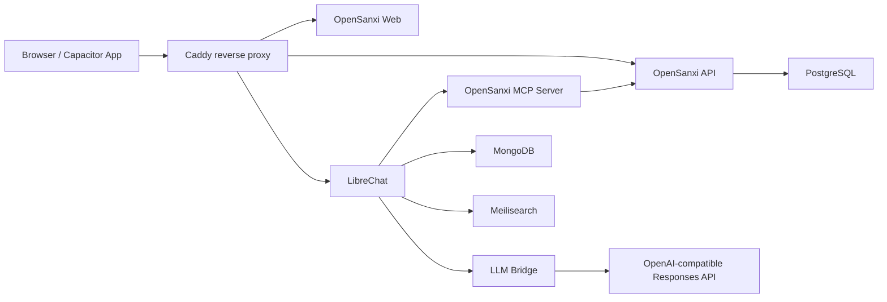

# OpenSanxi

English | [简体中文](README.zh-CN.md)

OpenSanxi is a self-hosted personal AI assistant that brings chat, memos,
personal finance records, and personal data lookup into one lightweight web
entry point. It is designed for your own server, NAS, mini PC, local Docker
Desktop setup, or a Capacitor Android wrapper.

The goal is simple: you can read and manage your own memos and finance records,
and your AI assistant can create, search, and organize that data for you.

## Features

- Chat with an AI assistant through LibreChat
- Create, edit, delete, and search memos
- Render memo Markdown
- Convert Markdown tables into mobile-friendly field cards on small screens
- Create, edit, and delete income/expense records
- View income, expense, net, and category summaries
- Expose memo and finance tools through an MCP server
- Deploy with Docker Compose
- Optionally integrate Hermes Agent
- Connect to OpenAI or any OpenAI Responses API-compatible upstream

## Architecture



## Repository Layout

```text
apps/
  api/          Fastify + Prisma backend API
  web/          React + Vite web frontend
  mcp-server/   MCP tools for AI access
  llm-bridge/   LibreChat Chat Completions to Responses API bridge
deploy/
  docker/       Docker Compose deployment files
```

## Quick Start

Requirements:

- Docker Desktop or Docker Engine
- Node.js 20+ only if you want to develop services outside Docker

```powershell
git clone https://github.com/Invoser/opensanxi.git
cd opensanxi\deploy\docker
Copy-Item .\env\.env.example .\.env
```

Edit `.env` and at least change:

| Variable | Purpose |
| --- | --- |
| `BASIC_AUTH_USER` | Outer login username |
| `BASIC_AUTH_HASH` | Caddy Basic Auth password hash |
| `API_SERVER_KEY` | Shared secret between LibreChat and LLM Bridge |
| `UPSTREAM_API_KEY` or `OPENAI_API_KEY` | AI provider API key |
| `POSTGRES_PASSWORD` | PostgreSQL password |
| `MONGO_INITDB_ROOT_PASSWORD` | MongoDB password |
| `MEILI_MASTER_KEY` | Meilisearch key |

Generate `BASIC_AUTH_HASH`:

```powershell
docker run --rm caddy:2.10-alpine caddy hash-password --plaintext "your-password"
```

Start the web, API, and database stack:

```powershell
docker compose --env-file .\.env -f .\compose.yaml -f .\compose.dev.yaml up -d
```

Start AI/chat services too:

```powershell
docker compose --env-file .\.env -f .\compose.yaml -f .\compose.dev.yaml --profile ai --profile chat up -d
```

Open:

```text
http://localhost:8088
```

## Docker Profiles

Without a profile, Compose starts:

- Caddy
- Web
- API
- API migration
- PostgreSQL

Optional profiles:

| Profile | Services |
| --- | --- |
| `ai` | MCP Server, LLM Bridge, MongoDB |
| `chat` | LibreChat, LLM Bridge, LibreChat RAG, Meilisearch, MongoDB |
| `hermes` | Hermes Agent Gateway |

Common command:

```powershell
docker compose --env-file .\.env -f .\compose.yaml -f .\compose.dev.yaml --profile ai --profile chat up -d
```

Validate configuration:

```powershell
docker compose --env-file .\.env -f .\compose.yaml -f .\compose.dev.yaml --profile ai --profile chat config
```

## Local Development

Each app is an independent Node project.

API:

```powershell
cd apps\api
npm install
npm run build
```

Web:

```powershell
cd apps\web
npm install
npm run build
```

MCP Server:

```powershell
cd apps\mcp-server
npm install
npm run build
```

LLM Bridge:

```powershell
cd apps\llm-bridge
npm install
npm run build
```

For API development with a real database, start PostgreSQL through Docker and
set `DATABASE_URL`.

## AI Provider

OpenSanxi uses `llm-bridge` to convert LibreChat Chat Completions requests into
Responses API requests.

Common variables:

| Variable | Purpose |
| --- | --- |
| `UPSTREAM_BASE_URL` | OpenAI-compatible API base URL, defaults to `https://api.openai.com/v1` |
| `UPSTREAM_API_KEY` | Upstream provider API key |
| `OPENAI_API_KEY` | Alternative direct OpenAI API key |
| `LLM_BRIDGE_DEFAULT_MODEL` | Default model |
| `LLM_BRIDGE_REASONING_EFFORT` | Responses API reasoning effort |

For a non-OpenAI upstream that supports `/v1/responses`:

```env
UPSTREAM_BASE_URL=https://your-provider.example.com/v1
UPSTREAM_API_KEY=your-key
```

## LibreChat

OpenSanxi does not modify LibreChat source code. It connects to LibreChat through
Docker images and an external config file:

```text
deploy/docker/librechat/librechat.yaml
```

This keeps LibreChat independently upgradeable while OpenSanxi maintains only
its own connection layer, MCP tools, and data API.

## Hermes

Hermes is an optional profile, not a required default component. The repository
includes Hermes config templates:

```text
deploy/docker/hermes/config.yaml
deploy/docker/hermes/hermes.env.example
```

If you only want LibreChat + LLM Bridge, do not start the `hermes` profile.

## Production Notes

Before exposing OpenSanxi to the public internet:

- Change every default password and `change-me` value
- Set strong `BASIC_AUTH_USER` and `BASIC_AUTH_HASH`
- Disable public LibreChat registration unless you intentionally want it
- Use HTTPS
- Never commit real `.env` files
- Back up PostgreSQL and MongoDB regularly
- Encrypt backups that contain personal data

Production reference:

```powershell
cd deploy\docker
docker compose --env-file .\.env -f .\compose.yaml -f .\compose.prod.yaml --profile ai --profile chat config
docker compose --env-file .\.env -f .\compose.yaml -f .\compose.prod.yaml --profile ai --profile chat up -d
```

## Upstream Projects And License

OpenSanxi integrates with or references these open-source projects:

| Project | Purpose | License |
| --- | --- | --- |
| [LibreChat](https://github.com/danny-avila/LibreChat) | Chat frontend and conversation system | MIT |
| [Hermes Agent](https://github.com/NousResearch/hermes-agent) | Optional AI Agent Gateway | MIT |
| [OpenClaw](https://github.com/openclaw/openclaw) | Evaluated during design; not bundled in this repository | MIT |

Because the relevant upstream projects are MIT-licensed, OpenSanxi is also
released under the MIT License. See:

- `LICENSE`
- `THIRD_PARTY_NOTICES.md`

## Current Status

OpenSanxi is currently an MVP for personal self-hosted assistants:

- Good for personal use and secondary development
- API, Web, MCP, and LLM Bridge are split into separate apps
- Docker deployment path is usable
- Access control currently relies mainly on outer Basic Auth and LibreChat login

Possible next steps:

- More complete multi-user permissions
- More detailed audit logs
- Mobile app packaging config
- Backup/restore automation
- More personal data source integrations
