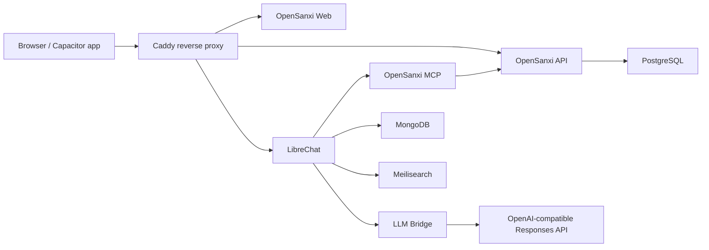

# OpenSanxi

OpenSanxi is a self-hosted personal AI assistant for chat, memos, and personal
finance records. It gives you a web UI for reading and editing your data, plus
AI tools so a chat assistant can create memos, record transactions, and search
your saved information.

## What It Does

- Chat with an AI assistant through LibreChat.
- Save, edit, delete, and search memos.
- Render memo Markdown, including mobile-friendly table cards.
- Record income and expense transactions.
- View finance totals and category summaries.
- Expose memo and finance tools through an MCP server.
- Run locally or on a small server with Docker Compose.

## Architecture



## Repository Layout

```text
apps/
  api/          Fastify + Prisma API
  web/          React + Vite web app
  mcp-server/   MCP server for memo and finance tools
  llm-bridge/   Chat Completions to Responses API bridge
deploy/
  docker/       Docker Compose deployment
```

## Quick Start With Docker

Requirements:

- Docker Desktop or Docker Engine
- Node.js 20+ if you want to run services outside Docker

```powershell
git clone https://github.com/Invoser/opensanxi.git
cd opensanxi\deploy\docker
Copy-Item .\env\.env.example .\.env
```

Edit `.env`:

- Set `BASIC_AUTH_USER`.
- Set `BASIC_AUTH_HASH`.
- Set `API_SERVER_KEY`.
- Set `UPSTREAM_API_KEY` or `OPENAI_API_KEY`.

Generate `BASIC_AUTH_HASH`:

```powershell
docker run --rm caddy:2.10-alpine caddy hash-password --plaintext "your-password"
```

Start the web/API stack:

```powershell
docker compose --env-file .\.env -f .\compose.yaml -f .\compose.dev.yaml up -d
```

Start chat and AI tooling too:

```powershell
docker compose --env-file .\.env -f .\compose.yaml -f .\compose.dev.yaml --profile ai --profile chat up -d
```

Open `http://localhost:8088`.

## Local Development

Each app is a small Node project:

```powershell
cd apps\api
npm install
npm run build
```

```powershell
cd apps\web
npm install
npm run build
```

```powershell
cd apps\mcp-server
npm install
npm run build
```

```powershell
cd apps\llm-bridge
npm install
npm run build
```

For database-backed API development, use the Docker stack for Postgres and set
`DATABASE_URL` before running migrations.

## Configuration

Important environment variables:

| Variable | Purpose |
| --- | --- |
| `BASIC_AUTH_USER` | Outer web login username for Caddy |
| `BASIC_AUTH_HASH` | Caddy password hash |
| `API_SERVER_KEY` | Shared bearer token between LibreChat and the LLM bridge |
| `UPSTREAM_BASE_URL` | OpenAI-compatible API base URL |
| `UPSTREAM_API_KEY` / `OPENAI_API_KEY` | Provider API key |
| `LLM_BRIDGE_DEFAULT_MODEL` | Default chat model |
| `LLM_BRIDGE_REASONING_EFFORT` | Responses API reasoning effort |
| `POSTGRES_PASSWORD` | PostgreSQL password |
| `MONGO_INITDB_ROOT_PASSWORD` | MongoDB password |
| `MEILI_MASTER_KEY` | Meilisearch master key |

Never commit real `.env` files, database dumps, uploaded files, or generated
deployment bundles.

## Upstream Projects And License

OpenSanxi integrates with two major open-source projects:

- [LibreChat](https://github.com/danny-avila/LibreChat), MIT License
- [Hermes Agent](https://github.com/NousResearch/hermes-agent), MIT License

OpenClaw was evaluated during design and is also MIT-licensed, but this
repository does not bundle OpenClaw source code.

Because the relevant upstream licenses are MIT, OpenSanxi is also released under
the MIT License. See `LICENSE` and `THIRD_PARTY_NOTICES.md`.

## Security Notes

OpenSanxi is designed for self-hosting. Before exposing it to the public
internet:

- Use strong Basic Auth credentials.
- Disable public LibreChat registration unless you intentionally want it.
- Rotate any keys that were used during local testing.
- Put real secrets only in local `.env` files or your deployment secret store.
- Back up Postgres and Mongo data with encryption if they contain personal data.
