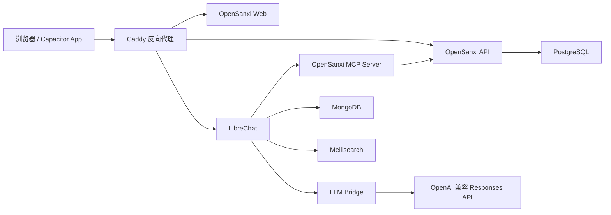

# OpenSanxi

[English](README.md) | 简体中文

OpenSanxi 是一个自托管的个人 AI 助手项目，用来把聊天、备忘录、记账和个人数据查询放在一个轻量 Web 入口里。它适合部署在自己的服务器、NAS、小主机或本地 Docker Desktop 上，也可以作为 Capacitor 安卓壳的 Web 后端。

项目目标很朴素：你可以自己看备忘录和收支记录，也可以让 AI 帮你创建、查询和整理这些数据。

## 功能

- 通过 LibreChat 与 AI 对话
- 创建、编辑、删除和搜索备忘录
- 备忘录支持 Markdown 渲染
- 手机端会把 Markdown 表格自动转换成更好读的字段卡片
- 创建、编辑、删除收入/支出记录
- 查看收入、支出、净额和分类汇总
- 通过 MCP Server 暴露备忘录和记账工具给 AI 调用
- 提供 Docker Compose 部署方案
- 可选接入 Hermes Agent
- 可接入 OpenAI 或兼容 OpenAI Responses API 的上游服务

## 架构



## 目录结构

```text
apps/
  api/          Fastify + Prisma 后端 API
  web/          React + Vite Web 前端
  mcp-server/   给 AI 使用的 MCP 工具服务
  llm-bridge/   LibreChat Chat Completions 到 Responses API 的桥接服务
deploy/
  docker/       Docker Compose 部署文件
```

## 快速开始

需要：

- Docker Desktop 或 Docker Engine
- Node.js 20+，仅在你想本地单独开发服务时需要

```powershell
git clone https://github.com/Invoser/opensanxi.git
cd opensanxi\deploy\docker
Copy-Item .\env\.env.example .\.env
```

编辑 `.env`，至少修改这些值：

| 变量 | 说明 |
| --- | --- |
| `BASIC_AUTH_USER` | 外层登录用户名 |
| `BASIC_AUTH_HASH` | Caddy Basic Auth 密码哈希 |
| `API_SERVER_KEY` | LibreChat 和 LLM Bridge 之间的共享密钥 |
| `UPSTREAM_API_KEY` 或 `OPENAI_API_KEY` | AI 服务 API Key |
| `POSTGRES_PASSWORD` | PostgreSQL 密码 |
| `MONGO_INITDB_ROOT_PASSWORD` | MongoDB 密码 |
| `MEILI_MASTER_KEY` | Meilisearch 密钥 |

生成 `BASIC_AUTH_HASH`：

```powershell
docker run --rm caddy:2.10-alpine caddy hash-password --plaintext "your-password"
```

只启动 Web、API 和数据库：

```powershell
docker compose --env-file .\.env -f .\compose.yaml -f .\compose.dev.yaml up -d
```

同时启动 AI/Chat 相关服务：

```powershell
docker compose --env-file .\.env -f .\compose.yaml -f .\compose.dev.yaml --profile ai --profile chat up -d
```

打开：

```text
http://localhost:8088
```

## Docker Profiles

默认不加 profile 时，会启动：

- Caddy
- Web
- API
- API migration
- PostgreSQL

可选 profiles：

| Profile | 内容 |
| --- | --- |
| `ai` | MCP Server、LLM Bridge、MongoDB |
| `chat` | LibreChat、LLM Bridge、LibreChat RAG、Meilisearch、MongoDB |
| `hermes` | Hermes Agent Gateway |

常用启动命令：

```powershell
docker compose --env-file .\.env -f .\compose.yaml -f .\compose.dev.yaml --profile ai --profile chat up -d
```

查看配置是否正确：

```powershell
docker compose --env-file .\.env -f .\compose.yaml -f .\compose.dev.yaml --profile ai --profile chat config
```

## 本地开发

每个 app 都是独立 Node 项目。

API：

```powershell
cd apps\api
npm install
npm run build
```

Web：

```powershell
cd apps\web
npm install
npm run build
```

MCP Server：

```powershell
cd apps\mcp-server
npm install
npm run build
```

LLM Bridge：

```powershell
cd apps\llm-bridge
npm install
npm run build
```

如果要本地跑 API，并连接数据库，建议先用 Docker 启动 PostgreSQL，再设置 `DATABASE_URL`。

## AI 接入方式

OpenSanxi 默认通过 `llm-bridge` 把 LibreChat 的 Chat Completions 请求转换成 Responses API 请求。

常用配置：

| 变量 | 说明 |
| --- | --- |
| `UPSTREAM_BASE_URL` | OpenAI 兼容接口地址，默认 `https://api.openai.com/v1` |
| `UPSTREAM_API_KEY` | 上游服务 API Key |
| `OPENAI_API_KEY` | 也可以直接使用 OpenAI API Key |
| `LLM_BRIDGE_DEFAULT_MODEL` | 默认模型 |
| `LLM_BRIDGE_REASONING_EFFORT` | Responses API reasoning effort |

如果你的上游不是 OpenAI 官方，但兼容 `/v1/responses`，设置：

```env
UPSTREAM_BASE_URL=https://your-provider.example.com/v1
UPSTREAM_API_KEY=your-key
```

## LibreChat

OpenSanxi 不修改 LibreChat 源码，而是通过 Docker 镜像和外部配置文件连接：

```text
deploy/docker/librechat/librechat.yaml
```

这样做的好处是 LibreChat 可以独立升级，OpenSanxi 只维护自己的连接层、MCP 工具和数据 API。

## Hermes

Hermes 是可选 profile，不是默认必需组件。当前仓库提供了 Hermes 的配置模板：

```text
deploy/docker/hermes/config.yaml
deploy/docker/hermes/hermes.env.example
```

如果你只想使用 LibreChat + LLM Bridge，可以不启动 `hermes` profile。

## 生产部署建议

部署到公网前请务必：

- 修改所有默认密码和 `change-me`
- 设置强 `BASIC_AUTH_USER` 和 `BASIC_AUTH_HASH`
- 关闭 LibreChat 公开注册，除非你确实想开放注册
- 使用 HTTPS 域名
- 不要提交真实 `.env`
- 定期备份 PostgreSQL 和 MongoDB
- 确认备份文件加密保存

生产环境可以参考：

```powershell
cd deploy\docker
docker compose --env-file .\.env -f .\compose.yaml -f .\compose.prod.yaml --profile ai --profile chat config
docker compose --env-file .\.env -f .\compose.yaml -f .\compose.prod.yaml --profile ai --profile chat up -d
```

## 开源项目与协议

OpenSanxi 集成或参考了这些开源项目：

| 项目 | 用途 | 协议 |
| --- | --- | --- |
| [LibreChat](https://github.com/danny-avila/LibreChat) | Chat 前端和对话系统 | MIT |
| [Hermes Agent](https://github.com/NousResearch/hermes-agent) | 可选 AI Agent Gateway | MIT |
| [OpenClaw](https://github.com/openclaw/openclaw) | 设计阶段参考，当前仓库不包含其源码 | MIT |

因为相关上游项目均为 MIT 协议，OpenSanxi 也使用 MIT 协议发布。详见：

- `LICENSE`
- `THIRD_PARTY_NOTICES.md`

## 当前状态

OpenSanxi 目前更像一个个人自托管助手的 MVP：

- 适合个人使用和二次开发
- API、Web、MCP、LLM Bridge 已拆分清楚
- Docker 部署路径可用
- 权限体系目前主要依赖外层 Basic Auth 和 LibreChat 自身登录

后续可以继续增强：

- 更完整的多用户权限
- 更细的审计日志
- 手机 App 打包配置
- 备份/恢复自动化
- 更多个人数据源接入
